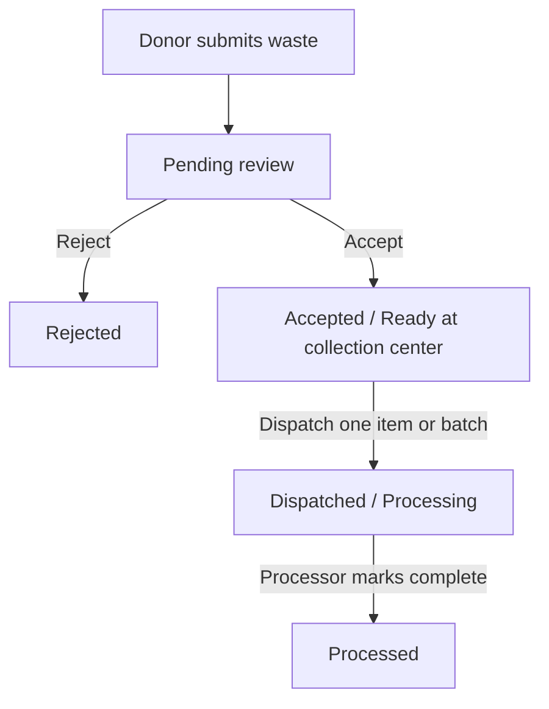
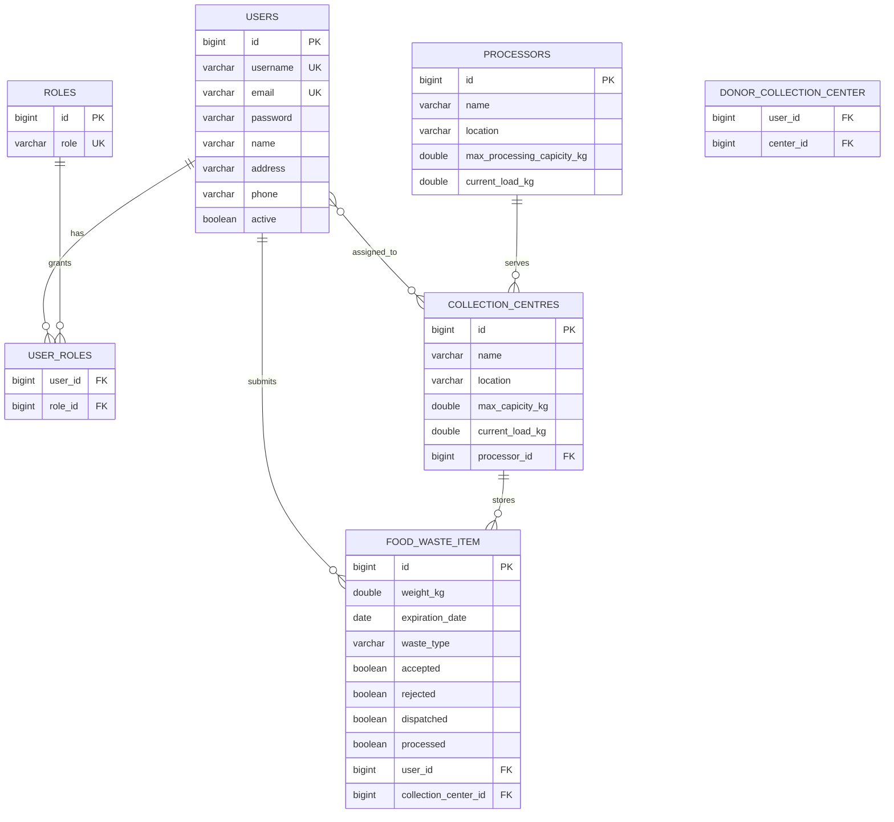

# Food Waste Management System Documentation

## 1. Purpose

The system manages food waste from donor submission through operator review, collection-center storage, dispatch, and processor completion.

The active workflow is:



## 2. Technology

- Frontend: React, Vite, React Router, Axios, Tailwind CSS, React Icons
- Backend: Spring Boot, Spring Security, JWT, Spring Data JPA, Maven
- Database: PostgreSQL
- Authentication: JWT stored in browser local storage
- Roles: `ROLE_ADMIN`, `ROLE_OPERATOR`, `ROLE_DONOR`

## 3. Roles and Responsibilities

### Admin

- View,edit and manage all system users.
- View donor profile and donation details from User Management.
- Activate or deactivate users.
- Create, edit, and delete collection centers.
- Create, edit, and delete processors.
- Edit and delete waste items.
- View reports and statistics.
  
- cannot change user roles.
- Cannot create donor profiles manually.
- Cannot create new waste items from the waste UI.

### Operator

- Review donor submissions.
- Accept or reject pending waste.
- View donor donation history.
- View collection-center details.
- View processor details and capacity.
- Dispatch accepted, undispatched waste.
- Dispatch one item at a time from the center View panel or dispatch a center batch.
- Mark dispatched waste as processed through the processor detail workflow.
- View reports and statistics.
  
- Cannot add, edit, or delete collection centers.
- Cannot add or edit processors.

### Donor

- Register and create their own donor profile.
- Select collection centers assigned to their profile.
- Submit food waste.
- View their donation history.
- Edit only pending submissions.
  

## 4. Waste Item State Model

The item state is represented by boolean fields. The valid user-facing states are derived in this order:

| State | Conditions | Meaning |
|---|---|---|
| Pending | `accepted=false`, `rejected=false` | Submitted and waiting for operator review |
| Accepted / Ready | `accepted=true`, `rejected=false`, `dispatched=false`, `processed=false` | Stored at a collection center and eligible for dispatch |
| Rejected | `rejected=true` | Rejected by an operator and excluded from dispatch |
| Dispatched / Processing | `accepted=true`, `dispatched=true`, `processed=false` | Sent to a processor and awaiting completion |
| Processed | `accepted=true`, `dispatched=true`, `processed=true` | Processing completed |

The dispatch queue only contains:

```text
accepted = true
rejected = false
dispatched = false
processed = false
```

Dispatch uses FEFO ordering: the earliest expiration date is shown first. Items expiring within three days are highlighted as near expiry.

## 5. End-to-End Functions

### Authentication

- Register a user.
- Assign donor, operator, or admin role.
- Hash passwords with BCrypt.
- Authenticate credentials and issue a JWT.
- Attach the JWT to API requests.
- Redirect unauthenticated users to login.

### Donor Functions

- Create a donor profile during donor signup.
- Update donor profile information and center assignments.
- Load donor-specific waste history.
- Submit waste with weight, type, expiry date, donor user, and collection center.
- Prevent editing after operator review or dispatch.

### Operator Review Functions

- Load all submitted waste items.
- Filter by date, type, and status.
- Accept only pending items.
- Reject only pending items.
- Show acceptance and rejection confirmation modals.
- Keep rejected items in history without dispatch eligibility.

### Collection Center Functions

- Display center name, location, processor, and capacity.
- Calculate active center load from accepted, non-rejected, undispatched items.
- Mark a center near capacity at 80 percent or above.
- Show current waste items in the center View panel.
- Show donor name beside each current waste item.
- Dispatch one accepted item from the View panel.
- Dispatch all eligible accepted items as a batch.
- Remove dispatched items from the dispatch queue.

### Dispatch Functions

- `/dispatch_waste` shows accepted items that are ready to dispatch.
- The queue is sorted by expiration date.
- The status filter supports `All statuses` and `Accepted / Ready` for the active queue.
- The collection-center View panel can show accepted and dispatched/processing items.
- Processed items are removed from dispatch-oriented views.
- Every dispatch validates the assigned processor and processor capacity.

### Processor Functions

- View processor name, location, current load, and maximum capacity.
- View capacity status: Available, Near Full, or Full.
- View dispatched waste waiting for processing.
- Mark dispatched waste as processed.
- Decrease processor load when an item is completed.
- View total completed processing weight.

### Reports and Statistics

- Waste type frequency.
- Waste type weight.
- Top donors.
- Full waste and processing report.
- Admin dashboard system metrics.
- Operator dashboard workflow metrics:
  - Awaiting Review
  - Ready to Dispatch
  - Near Expiry
  - Processing
  - Processed Today

## 6. Backend API Areas

### Authentication

Base path: `/api/auth`

- Login
- Registration
- JWT response generation

### Users

Base path: `/api/users`

- `GET /api/users`: admin user list with safe user detail DTOs
- `GET /api/users/{id}`: user details
- `PUT /api/users/{id}/roles`: replace user roles
- `PATCH /api/users/{id}/status`: activate or deactivate user
- `DELETE /api/users/{id}`: delete user

### Donor Profiles

Base path: `/api/food-donors`

- Read donor users for operator/admin workflows.
- Donor profile creation is restricted to donor users.
- Donor profile update supports center assignments.

The API keeps the donor response shape for frontend compatibility, but donor data is stored on `users`.

### Waste Items

Base path: `/api/food-waste-items`

- `GET /api/food-waste-items`: list waste items
- `GET /api/food-waste-items/{id}`: item details
- `GET /api/food-waste-items/by-donor/{donorId}`: donor history
- `GET /api/food-waste-items/by-center/{centerId}`: center items
- `POST /api/food-waste-items`: donor submission
- `PUT /api/food-waste-items/{id}`: update item when authorized
- `PATCH /api/food-waste-items/{id}/accept`: accept pending item
- `PATCH /api/food-waste-items/{id}/reject`: reject pending item
- `PATCH /api/food-waste-items/{id}/complete`: mark dispatched item processed
- `DELETE /api/food-waste-items/{id}`: admin deletion
- FEFO and processing queue endpoints

### Collection Centers

Base path: `/api/collection-centers`

- `GET /api/collection-centers`: list centers
- `POST /api/collection-centers`: admin create
- `PUT /api/collection-centers/{id}`: admin update
- `DELETE /api/collection-centers/{id}`: admin delete
- `POST /api/collection-centers/{id}/dispatch`: batch dispatch
- `POST /api/collection-centers/{centerId}/dispatch/{itemId}`: dispatch one item
- Ranked center endpoint for allocation support

### Processors

Base path: `/api/processors`

- List processor details.
- View one processor.
- Create and update processor records for authorized management workflows.
- Delete processor as admin.
- View processor load summary.

### Reports

Base path: `/api/reports`

- Waste type frequency.
- Waste type weight.
- Top donors.
- Full report.

## 7. Database Relationships

The donor identity is unified into the `users` table. There is no active `food_donors` entity in the current model.



### Relationship Details

- One user can have one or more roles through `user_roles`.
- Users with `ROLE_DONOR` are donor users.
- A donor user can be assigned to many collection centers.
- A collection center can have many donor users.
- One donor user can submit many food-waste items.
- Each waste item belongs to one donor user.
- A collection center can store many waste items.
- Each waste item belongs to one collection center.
- A collection center can be assigned to one processor.
- A processor can serve many collection centers.

## 8. Frontend Structure

### Shared Layout

- `DashboardLayout`: protected application shell and responsive content area.
- `Sidebar`: role-based navigation and responsive mobile drawer.
- `PaginatedTable`: pagination wrapper.
- `Table`: desktop table layout with mobile card layout.
- `Modal`: shared modal shell.
- `StatCard`, `CapacityBar`: reusable dashboard metrics and capacity display.

### Main Pages

- `Dashboard`: role-specific dashboard metrics and actions.
- `WasteItemsPage`: donor submission and operator review workflow.
- `Centers`: collection-center details and admin center management.
- `DispatchWastePage`: accepted dispatch queue.
- `ProcessorsPage`: processor capacity, dispatched queue, and completion action.
- `UsersPage`: admin user, donor profile, and donation details.
- `DonationHistoryPage`: donor/operator donation history and status totals.
- `Reports`: report and statistics views.

### Mobile Behavior

- Sidebar becomes a drawer on smartphones.
- Paginated tables become stacked item cards below the medium breakpoint.
- Tablet and laptop layouts retain table presentation.
- Wide content is constrained to the main content area so it cannot shrink the sidebar.

## 9. Seed Data

The SQL seed file provides:

- Admin, operator, and donor users.
- Role assignments.
- Processors and collection centers.
- Donor-center assignments through `user_id`.
- Pending, accepted, rejected, dispatched, and processed waste items.
- Near-expiry future dates for FEFO testing.
- Sequence resets after explicit seed IDs.

The database initializer also handles compatibility migrations for:

- `rejected`
- `accepted`
- `dispatched`
- Legacy `donor_id` to `user_id` columns
- Removal of the old `food_donors` table

## 10. Important Invariants

- Pending waste cannot be dispatched.
- Rejected waste cannot be dispatched.
- Dispatched waste cannot be dispatched again.
- Processed waste cannot return to the dispatch queue.
- Donors cannot edit accepted, rejected, dispatched, or processed waste.
- Only accepted and undispatched waste contributes to center load.
- Processor load decreases when dispatched waste is marked processed.
- Donor creation is tied to donor signup, not admin donor creation.
- Collection-center creation, update, and deletion are admin-only.
